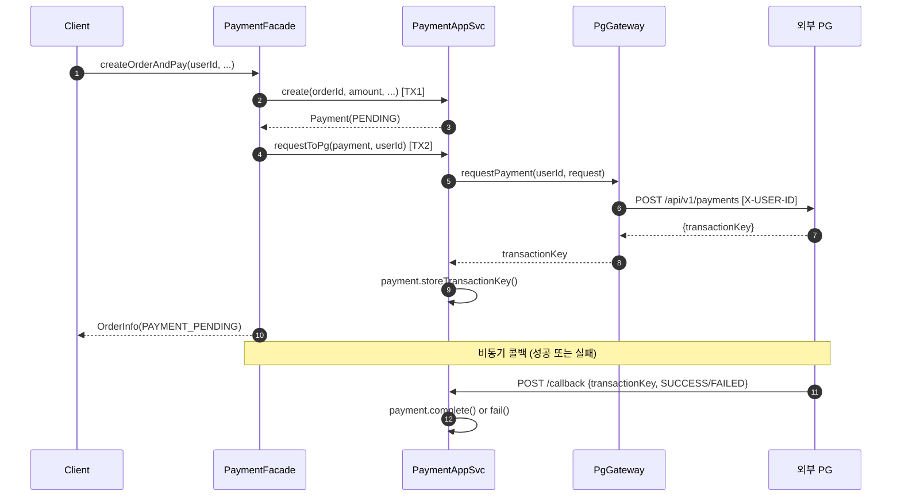
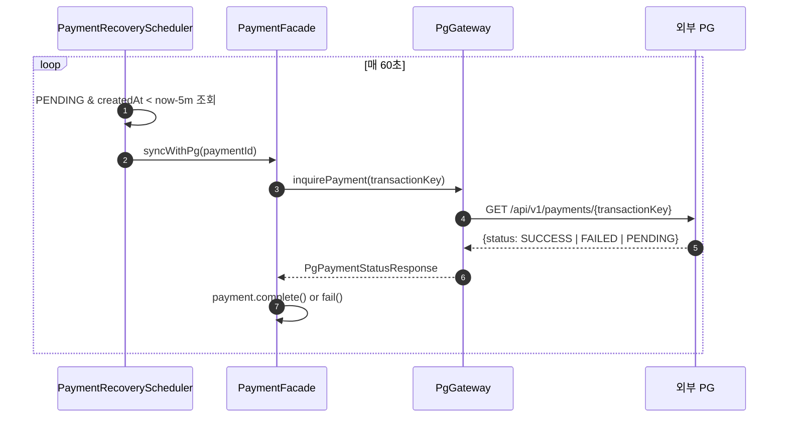
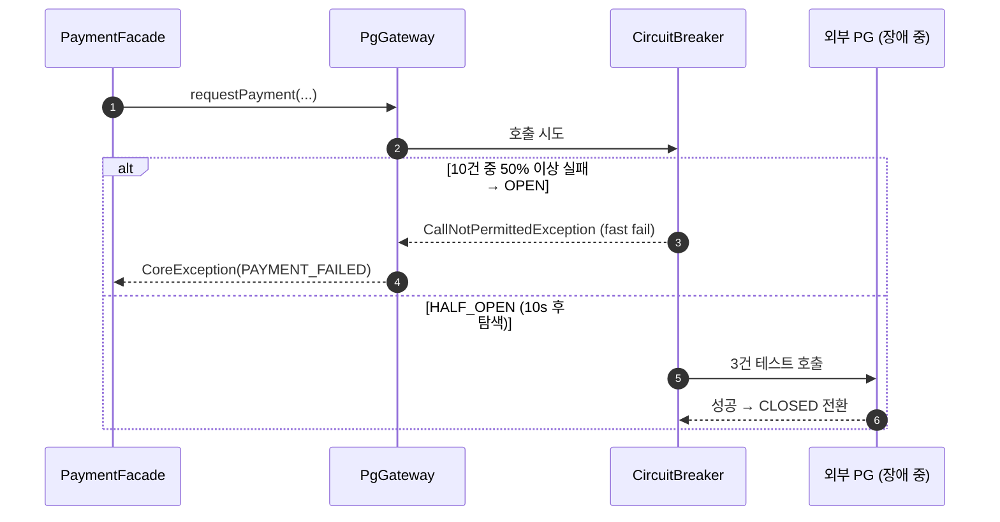

## 📌 Summary
<!--
무엇을/왜 바꿨는지 한눈에 보이게 작성한다.
- 문제(배경) / 목표 / 결과(효과) 중심으로 3~5줄 권장한다.
-->

- **배경:** PG(Payment Gateway)는 외부 시스템이므로 언제든 느려지거나 실패할 수 있다. 콜백 유실, 순간적 타임아웃, 동시 요청 폭증 등 다양한 장애 시나리오에 대해 서비스가 스스로 회복할 수 있는 구조가 필요했다.
- **목표:** Resilience4j(Circuit Breaker · Retry · Bulkhead)와 Recovery Scheduler를 도입해 PG 장애가 커머스 API 전체로 전파되지 않도록 격리하고, 콜백 유실 시에도 결제 상태가 최종 일관성을 유지하도록 한다.
- **결과:** PG 호출 경로에 세 겹의 방어선을 적용했고, 스케줄러가 60초마다 5분 이상 PENDING인 결제를 PG에 직접 조회해 보정한다. 로컬 PG 시뮬레이터를 외부 공식 시뮬레이터(40% 카오스 실패율)로 전환해 실제 장애 상황과 유사한 환경에서 검증 가능해졌다.


## 🧭 Context & Decision
<!--
설계 의사결정 기록을 남기는 영역이다.
"왜 이렇게 했는가"가 핵심이다.
-->

### 문제 정의
- **현재 동작/제약:** 결제 요청은 외부 PG에 HTTP 호출로 위임된다. PG는 비동기 콜백으로 결제 결과를 통보하므로, 콜백이 유실되거나 PG가 일시 불능이 되면 주문이 영구적으로 `PAYMENT_PENDING` 상태에 머문다.
- **문제(또는 리스크):**
  1. PG 응답 지연 → API 스레드 블로킹 → 전체 서버 응답 불능 (장애 전파)
  2. 순간 과부하 시 PG 요청 실패 → 주문이 미결 상태로 고착
  3. 콜백 유실(네트워크 오류, 재배포 등) → 사용자는 결제 완료인데 시스템은 PENDING
- **성공 기준:** PG가 30초 이상 응답 없어도 API가 정상 응답하고, 콜백 없이도 5분 이내 결제 상태가 최종 상태로 수렴한다.

### 선택지와 결정

**Circuit Breaker 임계값 (50%, window=10)**
- **A. 보수적 (30%, window=20):** 오탐(false open) 가능성 증가. 간헐적 실패에도 서킷이 열려 정상 요청까지 차단.
- **B. 현재 (50%, window=10):** 최근 10건 중 절반이 실패해야 서킷 오픈.
- **최종 결정:** B. 외부 시뮬레이터의 40% 의도적 실패율을 고려할 때, 50% 임계값은 정상 범위의 실패는 허용하되 완전 다운 시에만 서킷을 여는 균형점이다.
- **트레이드오프:** 실제 운영환경에서는 PG별 SLA를 기준으로 10~20%로 낮춰야 할 수 있다.

**Retry (3회, 1초 간격)**
- **A. 즉시 재시도 (no wait):** PG 과부하 상태일 때 재시도가 부하를 가중시켜 역효과.
- **B. 현재 (3회, 1s wait):** 최대 추가 지연 2초. 순간적 네트워크 결함을 커버하면서 응답 시간에 큰 영향 없음.
- **최종 결정:** B. `feign.RetryableException`만 재시도 대상으로 한정해 의도적 4xx는 재시도하지 않는다.
- **추후 개선 여지:** Exponential backoff 적용 시 PG 과부하 상황에서 더 안전하다.

**Bulkhead (동시 20건, wait=0ms)**
- **A. 무제한:** PG가 느려질 때 API 스레드 전체가 PG 대기에 묶여 다른 API까지 응답 불능.
- **B. 현재 (20건, 즉시 실패):** PG 호출을 20개로 격리. 초과 요청은 즉시 거절.
- **최종 결정:** B. `max-wait-duration=0`으로 설정해 지연 전파를 원천 차단한다.

**Recovery Scheduler (60초 주기, 5분 임계)**
- **A. 콜백만 의존:** 콜백 유실 시 영구 미결. 운영팀이 수동 보정 필요.
- **B. 현재 (60s 주기 폴링):** 콜백 유실에 대한 안전망. 5분 임계는 "콜백이 충분히 올 시간"을 준 뒤 조회하는 기준.
- **최종 결정:** B. `fixedDelay`(이전 실행 완료 후 60초)로 중첩 실행을 방지한다.
- **추후 개선 여지:** 분산 환경에서는 ShedLock으로 단일 노드 실행 보장 필요.

**외부 PG 시뮬레이터 전환**
- **최종 결정:** 공식 외부 시뮬레이터(40% 실패율, `X-USER-ID` 인증)로 전환해 카오스 테스트 환경을 확보.
- **트레이드오프:** `CallbackSignatureValidator` 제거 — 외부 시뮬레이터가 HMAC 서명을 지원하지 않아 학습 범위 내에서 제거. 실제 운영에서는 필수 보안 요소이다.


## 🏗️ Design Overview
<!--
구성 요소와 책임을 간단히 정리한다.
-->

### 변경 범위
- **영향 받는 모듈/도메인:** `apps/commerce-api` — payment, order 도메인
- **신규 추가:** `PaymentRecoveryScheduler`, `PgGateway`(Resilience4j 적용), `Payment.storeTransactionKey()`
- **제거/대체:** `apps/pg-simulator` 모듈 → 외부 공식 시뮬레이터, `CallbackSignatureValidator` 제거

### 주요 컴포넌트 책임

| 컴포넌트 | 역할 |
|---|---|
| `PgGateway` | PG HTTP 호출 + Resilience4j 3중 방어(CB·Retry·Bulkhead) |
| `PaymentApplicationService` | 결제 생성/콜백 처리/PG 상태조회 — 단일 트랜잭션 단위 |
| `PaymentFacade` | 주문-결제 유스케이스 조율, 트랜잭션 경계 분리 |
| `PaymentRecoveryScheduler` | 60초마다 5분 초과 PENDING 결제를 PG에 폴링해 자동 보정 |


## 🔁 Flow Diagram
<!--
가능하면 Mermaid로 작성한다. (시퀀스/플로우 중 택1)
"핵심 경로"를 먼저 그리고, 예외 흐름은 아래에 분리한다.
-->

### Main Flow — 주문 + 결제 요청


### Exception Flow — 콜백 유실 시 Recovery Scheduler


### Exception Flow — PG 장애 시 Circuit Breaker



## ✅ 검증

```bash
# 1. 외부 PG 시뮬레이터 실행
git clone https://github.com/Loopers-dev-lab/loopback-be-l2-java-additionals.git
cd loopback-be-l2-java-additionals && git checkout feat/pg-simulator
./gradlew :apps:pg-simulator:bootRun  # → http://localhost:8082

# 2. 빌드 및 테스트
./gradlew :apps:commerce-api:build
./gradlew :apps:commerce-api:test

# 3. 수동 검증 (commerce-api 실행 후)
# http/pg-simulator/payments.http 로 결제 요청 → 40% 실패 포함 동작 확인
# http/orders/*.http 로 주문 생성 → PAYMENT_PENDING 확인
# 5분 대기 후 Recovery Scheduler 동작으로 상태 자동 전환 확인
```
