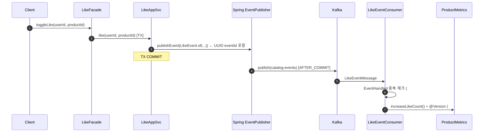
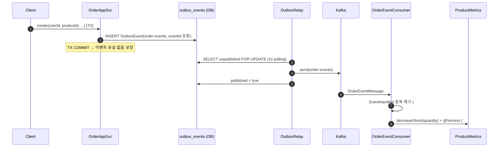
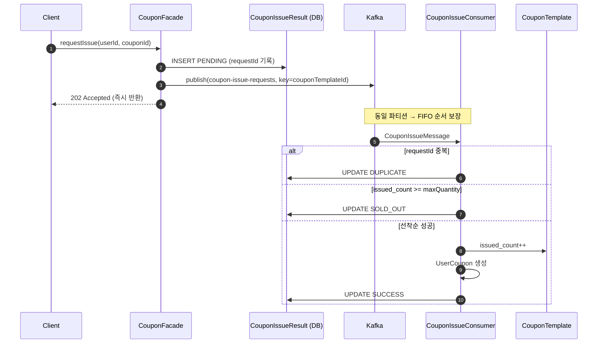
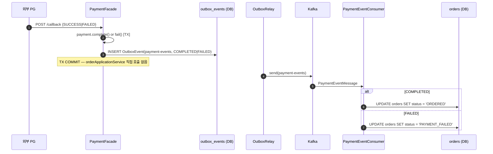

## 📌 Summary

- **배경:** 좋아요·주문·쿠폰 발급·결제 콜백이 모두 API 서버 내 동기 트랜잭션으로 처리되고 있어, 도메인 간 강결합과 API 응답 지연, 중복 처리 등의 리스크가 공존했다.
- **목표:** Kafka 이벤트 파이프라인을 도입해 ① 도메인 간 결합 제거, ② API 응답 지연 최소화, ③ at-least-once 환경에서 멱등성 보장, ④ MSA 관점에서 commerce-streamer가 독립적으로 상태를 관리할 수 있는 구조를 만든다.
- **결과:** 9개 구현 항목을 통해 이벤트 파이프라인 전체를 완성했고, Producer 안정성·Consumer 멱등성·낙관적 락·동시성 테스트까지 포함해 신뢰성 항목도 추가 적용했다.


## 🧭 Context & Decision

---

### #1. 이벤트 로그 (EventLog)

**목표:** 사용자 행동(좋아요·주문·쿠폰 발급)을 비침투적으로 기록한다.

**고민:** 각 도메인 서비스에 `eventLogRepository.save()`를 직접 삽입하면 비즈니스 로직과 로깅 관심사가 뒤섞인다.

**결정:** Spring ApplicationEvent + `@TransactionalEventListener(phase = AFTER_COMMIT)` 조합

```
LikeApplicationService.like()
  └── applicationEventPublisher.publishEvent(UserActionEvent)
        └── [TX COMMIT 후]
            UserActionEventListener.onUserAction()
              └── eventLogRepository.save(EventLog)
```

- `AFTER_COMMIT`을 사용해 TX 롤백 시 로그가 남지 않도록 보장
- 서비스 코드는 이벤트 발행만 하고 로깅 방식을 모름 → 관심사 분리
- `EventLog` 조회는 어드민 전용 API(`GET /api-admin/v1/event-logs`)로만 제공


---

### #2. 좋아요 Kafka 이벤트 → ProductMetrics like_count

**목표:** 좋아요/취소 시 `product_metrics.like_count`를 commerce-streamer가 비동기로 갱신한다.

**고민 1 — 왜 Transactional Outbox가 아닌 @TransactionalEventListener인가?**

| 기준 | LikeEvent | OrderCreated / PaymentResult |
|---|---|---|
| 유실 허용 | ✅ 좋아요 수는 eventual consistency 허용 | ❌ 재고·결제 불일치 불허 |
| 구현 비용 | @TransactionalEventListener(AFTER_COMMIT)으로 충분 | outbox_events INSERT + OutboxRelay 필요 |

→ 좋아요 이벤트는 Outbox 없이 `@TransactionalEventListener`로 처리. TX 커밋 후 발행하므로 롤백 오발행은 없다.

**고민 2 — TX 안에서 직접 Kafka publish를 하면 안 되나?**

- Kafka 브로커 응답 대기가 DB 트랜잭션을 점유 → Lock 경합 증가
- 브로커 일시 다운 시 TX 전체 롤백 → 비즈니스 로직까지 실패
- `AFTER_COMMIT`은 TX 밖에서 발행하므로 이 두 문제를 해결

**흐름:**
```
LikeApplicationService.like() [TX]
  └── publishEvent(LikeEvent.of(type, productId, userId))  ← UUID eventId 포함
        └── [TX COMMIT 후]
            LikeEventKafkaPublisher → catalog-events 토픽

LikeEventConsumer (commerce-streamer)
  ├── EventHandled 중복 체크 (eventId 기준)
  └── ProductMetrics.increaseLikeCount() + @Version 낙관적 락
```

**신규 도메인 객체:** `ProductMetrics(productId, likeCount, orderCount)` — commerce-api(집계용)와 commerce-streamer(갱신용) 양쪽에 최소 정의


---

### #3. 주문 생성 Outbox → OrderEventConsumer

**목표:** 주문 생성 시 재고 차감을 commerce-streamer가 처리하도록 이벤트로 분리한다.

**고민 — 왜 Outbox Pattern인가?**

재고 차감은 유실되면 안 된다. 두 가지 대안을 비교했다.

| 방식 | 문제 |
|---|---|
| TX 안에서 직접 Kafka publish | 브로커 응답 대기가 DB TX 점유. 브로커 장애 시 주문 TX 전체 실패 |
| TX 후 @TransactionalEventListener | TX 커밋 후 발행 실패 시 이벤트 유실. 재시도 메커니즘 없음 |
| **Transactional Outbox** | order INSERT + outbox_events INSERT = 동일 TX. 발행은 OutboxRelay가 별도 처리 |

→ DB 커밋 = 이벤트 보장. OutboxRelay가 실패 시 재시도.

**OutboxRelay 설계:**
```java
@Scheduled(fixedDelay = 1000)
public void relay() {
    List<OutboxEvent> events = outboxEventJpaRepository
        .findUnpublishedWithLock();          // FOR UPDATE — 다중 인스턴스 중복 발행 방지
    events.forEach(event -> {
        kafkaTemplate.send(event.getTopic(), event.getPartitionKey(), event.getPayload());
        event.markPublished();               // published = true 마킹
    });
}
```

**흐름:**
```
OrderApplicationService.create() [TX]
  ├── order INSERT
  └── outbox_events INSERT (topic=order-events, payload={ORDER_CREATED, orderId, productId, quantity, eventId})

OutboxRelay (1초 polling)
  └── KafkaTemplate.send(order-events)

OrderEventConsumer (commerce-streamer)
  ├── EventHandled 중복 체크
  └── ProductMetrics.decreaseStock(quantity)
```


---

### #4. 선착순 쿠폰 Kafka 비동기 발급

**목표:** 동시 요청이 폭주해도 선착순이 보장되고, API가 즉시 응답을 반환한다.

**고민 — 기존 동기 방식의 문제:**
- `UPDATE coupon_templates SET issued_count = issued_count + 1 WHERE id = ? AND issued_count < max_quantity` 방식
- 동시 요청 시 DB 행 잠금 경합 → 응답 지연, 타임아웃 위험
- API 응답이 쿠폰 발급 완료까지 블로킹됨

**결정 — Kafka를 큐로 사용한 직렬 처리:**

```
API: CouponIssueResult(PENDING) 저장 → coupon-issue-requests 발행 → 202 즉시 반환

CouponIssueConsumer (파티션 내 FIFO 처리):
  ├── 중복 요청 (requestId 기준) → DUPLICATE
  ├── issued_count >= max_quantity → SOLD_OUT
  └── 성공 → issued_count++, UserCoupon 생성, SUCCESS
```

**선착순 보장 원리:** 같은 `couponTemplateId`를 Kafka 파티션 키로 사용하면 파티션 내 순서(FIFO)가 보장된다. 동일 파티션의 메시지는 하나의 Consumer 인스턴스가 순서대로 처리하므로 DB 잠금 없이 선착순 보장.

**CouponIssueResult 상태 흐름:**
```
PENDING → SUCCESS    : 발급 성공
PENDING → SOLD_OUT   : 재고 소진
PENDING → DUPLICATE  : 동일 requestId 중복 요청
```

클라이언트는 `GET /api/v1/coupons/issue-results/{requestId}` 로 결과를 폴링한다.


---

### #5. PG 콜백 이벤트 분리 (payment-events)

**목표:** Payment 도메인이 Order 도메인을 직접 호출하는 강결합을 제거한다.

**Before — 강결합 구조:**
```java
// PaymentFacade.handleCallback()
Payment payment = paymentApplicationService.handleCallback(callback);
if ("SUCCESS".equals(callback.status())) {
    orderApplicationService.confirmPayment(payment.getOrderId());  // ← Order 직접 호출
} else {
    orderApplicationService.failPayment(payment.getOrderId());     // ← Order 직접 호출
}
```

**문제:**
- commerce-api가 단일 배포 단위인 현재는 동작하지만, Payment와 Order를 독립 서비스로 분리하는 순간 불가능
- Payment 서비스가 Order 서비스의 메서드 시그니처에 의존

**After — Outbox 기반 이벤트:**
```java
// PaymentFacade.handleCallback()
Payment payment = paymentApplicationService.handleCallback(callback);
String status = "SUCCESS".equals(callback.status()) ? "COMPLETED" : "FAILED";
outboxRepository.save(OutboxEvent.forPaymentResult(payment.getOrderId(), status));
// orderApplicationService 호출 없음
```

```
OutboxRelay → payment-events 토픽

PaymentEventConsumer (commerce-streamer)
  COMPLETED → UPDATE orders SET status = 'ORDERED'   WHERE id = ?
  FAILED    → UPDATE orders SET status = 'PAYMENT_FAILED' WHERE id = ?
```

**trade-off 인지 및 대응:**
- 주문 상태 갱신이 비동기화됨 → E2E 테스트에서 `order.getStatus()` 직접 검증 불가
- 테스트를 `outbox_events` 테이블에 `payment-events` 토픽 이벤트가 저장됐는지 검증으로 전환
- 재고 복원(`failPayment` 내 stock restore)은 현재 commerce-streamer 범위 밖 → 추후 이관 과제로 식별


---

### #6. Kafka Producer 안정성 — acks=all + enable.idempotence

**목표:** Producer 메시지 유실과 중복 발행을 방지한다.

**기본값(acks=1)의 문제:**

```
Producer → Leader 브로커 (acks=1 → 바로 응답)
                ↓ 복제 전 Leader 장애
           메시지 유실 (Follower에 없음)
```

**결정:**
```yaml
producer:
  acks: all          # 모든 ISR 레플리카가 저장을 확인해야 성공 응답
  retries: 3         # 일시적 장애 시 재시도
  properties:
    enable.idempotence: true                   # 재시도 시 중복 메시지 방지
    max.in.flight.requests.per.connection: 5   # idempotence 활성화 조건 (≤5)
```

**세 설정이 함께 동작해야 하는 이유:**

| 설정 | 단독 문제 | 함께 해결 |
|---|---|---|
| `acks=all` | 재시도 없으면 일시 장애 시 유실 | retries와 함께 내구성 보장 |
| `retries=3` | acks=1이면 재시도해도 의미 없음 | acks=all과 함께 재전송 보장 |
| `enable.idempotence` | max.in.flight>5면 순서 보장 불가 | max.in.flight=5와 함께 정확히 한 번 보장 |

`enable.idempotence=true`는 내부적으로 `acks=all`, `retries>0`, `max.in.flight≤5`를 강제하므로 세 값을 명시적으로 함께 선언했다.


---

### #7. Consumer 멱등성 — EventHandled 테이블

**목표:** Kafka at-least-once 환경에서 같은 이벤트가 2회 처리되어도 결과가 달라지지 않도록 한다.

**문제 시나리오:**
```
LikeEventConsumer가 like_count++ 처리 후 ack 전에 재시작
  → Kafka가 같은 메시지 재전송
  → like_count 2회 증가
```

**결정:** `event_handled` 테이블 + (topic, event_id) UNIQUE 제약

```sql
CREATE TABLE event_handled (
    id         BIGINT AUTO_INCREMENT PRIMARY KEY,
    topic      VARCHAR(100) NOT NULL,
    event_id   VARCHAR(36)  NOT NULL,
    UNIQUE KEY uq_event_handled_topic_event_id (topic, event_id)
);
```

**처리 흐름:**
```java
private void processLikeEvent(LikeEventMessage message) {
    // 1. 중복 체크
    if (eventHandledJpaRepository.existsByTopicAndEventId("catalog-events", message.eventId())) {
        log.info("이미 처리된 이벤트 skip: eventId={}", message.eventId());
        return;
    }
    // 2. 비즈니스 처리
    ProductMetrics metrics = productMetricsJpaRepository.findByProductId(message.productId());
    metrics.increaseLikeCount();
    productMetricsJpaRepository.save(metrics);
    // 3. 처리 완료 기록
    eventHandledJpaRepository.save(new EventHandled("catalog-events", message.eventId()));
}
```

**경쟁 조건 처리:** 두 Consumer 인스턴스가 동시에 같은 eventId를 삽입 시도하면 UNIQUE 제약 위반 → `DataIntegrityViolationException` → 후착 인스턴스가 자동으로 skip됨.

**eventId 전파 경로:**

| 이벤트 | 발행 측 | 소비 측 |
|---|---|---|
| LikeEvent | `LikeEvent.of()` 내부에서 UUID 생성 | `LikeEventMessage.eventId()` |
| OrderCreated | `OutboxEvent.forOrderCreated()` payload에 `"eventId":"<uuid>"` 포함 | `OrderEventMessage.eventId()` |


---

### #8. ProductMetrics 낙관적 락 — @Version

**목표:** commerce-streamer 다중 인스턴스가 동일 상품의 metrics를 동시에 수정할 때 Lost Update를 방지한다.

**문제:**
```
Instance A: SELECT metrics WHERE productId=1  → likeCount=5
Instance B: SELECT metrics WHERE productId=1  → likeCount=5
Instance A: UPDATE metrics SET likeCount=6    → 성공
Instance B: UPDATE metrics SET likeCount=6    → 성공 (A의 변경 덮어씀 = Lost Update)
```

**비관적 락 검토 후 기각:**
- `SELECT FOR UPDATE`는 처리량 저하, 데드락 위험
- Consumer가 배치로 수백 건을 처리하는 구조에서 비관적 락은 병목이 됨

**결정:** `@Version Long version` (낙관적 락)

```java
// ProductMetrics
@Version
private Long version;
```

```java
// LikeEventConsumer
try {
    productMetricsJpaRepository.saveAndFlush(metrics);
} catch (ObjectOptimisticLockingFailureException e) {
    // 다른 인스턴스가 먼저 처리 완료 → 이 처리는 skip해도 무결성 유지
    log.warn("낙관적 락 충돌 skip: productId={}", message.productId());
}
```

**낙관적 락이 Consumer에 적합한 이유:** EventHandled 멱등성 체크 + 낙관적 락 충돌 skip의 조합으로, 충돌이 발생해도 "최종적으로 정확히 한 번 반영"이 보장된다.


---

### #9. FCFS 선착순 쿠폰 동시성 테스트

**목표:** CouponIssueConsumer가 200개 동시 요청 중 정확히 maxQuantity(100)개만 SUCCESS 처리하는지 검증한다.

**테스트 설계:**

```java
@Test
void concurrentCouponIssue_exactlyMaxQuantitySucceed() throws InterruptedException {
    // 200개 요청 중 maxQuantity=100 설정
    CouponTemplate template = couponTemplateJpaRepository.save(new CouponTemplate("테스트쿠폰", 100));

    // 200개 CouponIssueResult(PENDING) 생성 (각기 다른 requestId, userId)
    List<ConsumerRecord<...>> records = createRecords(200, template.getId());

    // 200 스레드가 동시에 handleCouponIssueEvents() 호출
    ExecutorService executor = Executors.newFixedThreadPool(200);
    CountDownLatch latch = new CountDownLatch(200);
    // ... 동시 실행

    // 검증
    long successCount = couponIssueResultStreamerJpaRepository
        .findAll().stream().filter(r -> r.getStatus() == SUCCESS).count();
    long issuedCount = couponTemplateJpaRepository.findIssuedCountById(template.getId());

    assertThat(successCount).isEqualTo(100);
    assertThat(issuedCount).isEqualTo(100);
}
```

**테스트가 보장하는 것:**
- SUCCESS 정확히 100건 (초과 없음)
- `issued_count` == 100 (DB 정합성)
- 나머지 100건은 SOLD_OUT (유실 없음)


---

## 🏗️ Design Overview

### 모듈 책임

| 모듈 | 역할 |
|---|---|
| `commerce-api` | 이벤트 발행 (OutboxEvent 저장, @TransactionalEventListener, Kafka 직접 발행), EventLog API |
| `commerce-streamer` | 이벤트 소비 (LikeEvent·Order·Coupon·Payment 처리) |
| `modules/kafka` | Producer/Consumer 공통 설정 |

### 주요 컴포넌트 책임

| 컴포넌트 | 위치 | 역할 |
|---|---|---|
| `OutboxEvent` / `OutboxRepository` | commerce-api | Transactional Outbox 레코드 (order-events, payment-events) |
| `OutboxRelay` | commerce-api | 1초 polling → 미발행 OutboxEvent Kafka 발행 |
| `UserActionEventListener` | commerce-api | Spring ApplicationEvent → EventLog 저장 |
| `LikeEventKafkaPublisher` | commerce-api | LikeEvent → catalog-events 발행 (AFTER_COMMIT) |
| `EventHandled` | commerce-streamer | Consumer 멱등성 추적 (topic, event_id UNIQUE) |
| `LikeEventConsumer` | commerce-streamer | like_count 업데이트 + EventHandled + @Version |
| `OrderEventConsumer` | commerce-streamer | order_count 갱신 + EventHandled + @Version |
| `CouponIssueConsumer` | commerce-streamer | FCFS 발급 처리 (SUCCESS / SOLD_OUT / DUPLICATE) |
| `PaymentEventConsumer` | commerce-streamer | payment-events → 주문 상태 native SQL 업데이트 |
| `ProductMetrics` (@Version) | 양 모듈 | 낙관적 락으로 동시 수정 Lost Update 방어 |


## 🔁 Flow Diagram

### Flow 1 — 좋아요 이벤트 → like_count 업데이트 (#2)


### Flow 2 — 주문 생성 → Outbox → 재고 반영 (#3)


### Flow 3 — FCFS 쿠폰 비동기 발급 (#4)


### Flow 4 — PG 콜백 → payment-events → 주문 상태 갱신 (#5)



## ✅ Checklist

### 🧾 Step 1 — ApplicationEvent

- [x] **주문–결제 플로우에서 부가 로직을 이벤트 기반으로 분리한다.**
  - `PaymentFacade.handleCallback()` / `syncWithPg()`에서 `orderApplicationService` 직접 호출 제거
  - `OutboxEvent.forPaymentResult()` 저장 후 `PaymentEventConsumer`가 비동기로 주문 상태 갱신
  - 검증: `PaymentFacadeCallbackEventTest` — `orderApplicationService` 미호출 + `OutboxEvent` 저장 단위 테스트

- [x] **좋아요 처리와 집계를 이벤트 기반으로 분리한다. (집계 실패와 무관하게 좋아요는 성공)**
  - `LikeApplicationService`가 `LikeEvent`를 발행만 하고, `LikeEventConsumer`가 `like_count` 갱신
  - `@TransactionalEventListener(phase = AFTER_COMMIT)` 사용 — 좋아요 TX 커밋 후 발행하므로 집계 실패가 좋아요에 영향 없음
  - 검증: `LikeApplicationServiceTest` — like/unlike 후 이벤트 발행 여부, `LikeEventConsumerTest` — like_count 갱신

- [x] **유저 행동에 대한 서버 레벨 로깅을 이벤트로 처리한다.**
  - `UserActionEvent` 발행 → `UserActionEventListener`(AFTER_COMMIT)가 `EventLog` 저장
  - 서비스 코드는 이벤트 발행만 — 로깅 로직 비침투
  - 검증: `UserActionEventListenerTest`, `EventLogAdminV1ApiE2ETest`

- [x] **동작의 주체를 적절하게 분리하고, 트랜잭션 간의 연관관계를 고민한다.**
  - `AFTER_COMMIT`: 이벤트 로그·Kafka 발행 — TX 롤백 시 부가 작업 미실행
  - `BEFORE_COMMIT`이 아닌 `AFTER_COMMIT`을 선택한 이유: TX 롤백 케이스에서 오발행을 방지하기 위함
  - Outbox: 주문·결제 이벤트는 DB TX와 같은 트랜잭션으로 저장 → "커밋 = 이벤트 보장"

---

### 🎾 Step 2 — Kafka Producer / Consumer

- [x] **Step 1의 ApplicationEvent 중 시스템 간 전파가 필요한 이벤트를 Kafka로 발행한다.**
  - `catalog-events`: LikeEvent (AFTER_COMMIT 발행)
  - `order-events`: OrderCreated (Outbox → OutboxRelay)
  - `payment-events`: PaymentResult (Outbox → OutboxRelay)
  - `coupon-issue-requests`: CouponIssue (Kafka 직접 발행)

- [x] **`acks=all`, `idempotence=true` 설정**
  - `modules/kafka/src/main/resources/kafka.yml`에 `acks: all`, `enable.idempotence: true`, `max.in.flight.requests.per.connection: 5` 설정
  - 세 값은 함께 설정해야 의미 있음 (`enable.idempotence`가 나머지 두 값을 전제로 동작)
  - 검증: `KafkaProducerConfigTest` — ProducerFactory config 값 단위 테스트 (3개 항목)

- [x] **Transactional Outbox Pattern 구현**
  - `outbox_events` 테이블에 비즈니스 INSERT와 동일 TX로 저장
  - `OutboxRelay`: 1초 주기 polling, `FOR UPDATE` 비관적 락으로 다중 인스턴스 중복 발행 방지, 발행 후 `published=true` 마킹
  - 검증: `OrderApplicationServiceEventIntegrationTest` — 주문 생성 후 outbox_events 저장 검증

- [x] **PartitionKey 기반 이벤트 순서 보장**
  - `OutboxEvent.partitionKey` = `orderId` / `couponTemplateId` 기준 설정
  - 같은 주문·쿠폰 관련 이벤트가 동일 파티션으로 라우팅되어 처리 순서 보장

- [x] **Consumer가 Metrics 집계 처리 (product_metrics upsert)**
  - `LikeEventConsumer`: `like_count` 증감
  - `OrderEventConsumer`: `order_count` 증가, `stock` 차감
  - `ProductMetrics`: commerce-api(집계 조회)·commerce-streamer(갱신) 양쪽에 최소 정의
  - 검증: `ProductFacadeEventIntegrationTest`

- [x] **`event_handled` 테이블을 통한 멱등 처리 구현**
  - `event_handled(topic, event_id)` UNIQUE 제약으로 중복 처리 방지
  - `LikeEvent.of()`, `OutboxEvent.forOrderCreated()` 에서 UUID `eventId`를 payload에 포함해 Consumer까지 전달
  - 경쟁 조건: 동시 삽입 시 UNIQUE 제약 위반 → 후착 인스턴스 자동 skip
  - 검증: `LikeEventConsumerTest.skipsProcessing_whenEventAlreadyHandled`, `OrderEventConsumerTest.skipsProcessing_whenEventAlreadyHandled`

- [x] **manual Ack + `@Version` 기준 최신 이벤트만 반영**
  - 배치 Listener에서 처리 완료 후 `acknowledgment.acknowledge()` 호출 (manual ack)
  - `ProductMetrics`에 `@Version Long version` 낙관적 락 적용
  - 동시 수정 충돌 시 `ObjectOptimisticLockingFailureException` catch → skip (이미 다른 인스턴스가 처리)
  - 검증: `ProductMetricsOptimisticLockTest` — 동일 row 동시 수정 시 한쪽만 성공

---

### 🎫 Step 3 — 선착순 쿠폰 발급

- [x] **쿠폰 발급 요청 API → Kafka 발행 (비동기 처리)**
  - `POST /api/v1/coupons/{couponId}/issue` → `CouponIssueResult(PENDING)` 저장 → `coupon-issue-requests` 발행 → 202 즉시 반환
  - 검증: `CouponV1ApiE2ETest` — 202 응답 확인

- [x] **Consumer에서 선착순 수량 제한 + 중복 발급 방지 구현**
  - `issued_count >= max_quantity` → `SOLD_OUT`
  - 동일 `requestId` 재요청 → `DUPLICATE`
  - 성공 시 `issued_count++`, `UserCoupon` 생성, `SUCCESS`
  - 검증: `CouponIssueConsumerTest` — SOLD_OUT / DUPLICATE / SUCCESS 케이스별 단위 테스트

- [x] **발급 완료/실패 결과를 유저가 확인할 수 있는 구조 설계 (polling)**
  - `CouponIssueResult` 테이블에 `requestId` 기준으로 상태 저장 (PENDING → SUCCESS/SOLD_OUT/DUPLICATE)
  - `GET /api/v1/coupons/issue-results/{requestId}` 로 클라이언트가 폴링
  - 검증: `CouponFacadeEventIntegrationTest`

- [x] **동시성 테스트 — 수량 초과 발급이 발생하지 않는지 검증**
  - 200개 동시 요청, `maxQuantity=100` 조건
  - `SUCCESS` 정확히 100건, `SOLD_OUT` 100건, `issued_count == 100` 검증
  - 검증: `CouponIssueConsumerConcurrencyTest`

---

## ✅ 검증

```bash
# 전체 테스트
./gradlew :apps:commerce-api:test
./gradlew :apps:commerce-streamer:test

# #6 Kafka Producer 안정성
./gradlew :apps:commerce-api:test --tests "*.KafkaProducerConfigTest"

# #7 Consumer 멱등성
./gradlew :apps:commerce-streamer:test --tests "*.LikeEventConsumerTest"
./gradlew :apps:commerce-streamer:test --tests "*.OrderEventConsumerTest"

# #8 ProductMetrics 낙관적 락
./gradlew :apps:commerce-streamer:test --tests "*.ProductMetricsOptimisticLockTest"

# #9 FCFS 동시성
./gradlew :apps:commerce-streamer:test --tests "*.CouponIssueConsumerConcurrencyTest"

# #5 PG 콜백 이벤트 분리
./gradlew :apps:commerce-api:test --tests "*.PaymentFacadeCallbackEventTest"
./gradlew :apps:commerce-streamer:test --tests "*.PaymentEventConsumerTest"
```
