# 시퀀스 다이어그램

## 사용자 API

---

### 브랜드 상세 조회

**목적**: 단순 조회 흐름에서 삭제된 엔티티의 처리 방식과, 단일 서비스 호출 시 UseCase 없이 API → Domain 직접 호출 구조를 확인한다.

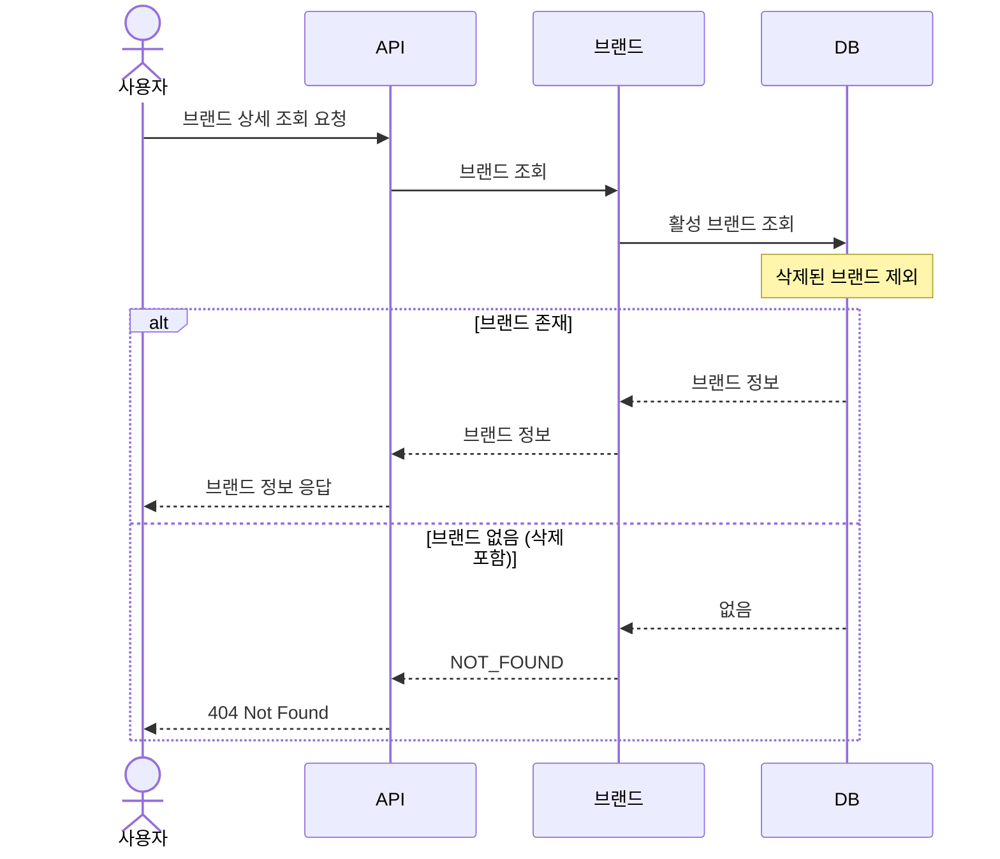
```mermaid
sequenceDiagram
    actor 사용자
    participant API
    participant 브랜드
    participant DB

    사용자->>API: 브랜드 상세 조회 요청
    API->>브랜드: 브랜드 조회
    브랜드->>DB: 활성 브랜드 조회
    Note over DB: 삭제된 브랜드 제외

    alt 브랜드 존재
        DB-->>브랜드: 브랜드 정보
        브랜드-->>API: 브랜드 정보
        API-->>사용자: 브랜드 정보 응답
    else 브랜드 없음 (삭제 포함)
        DB-->>브랜드: 없음
        브랜드-->>API: NOT_FOUND
        API-->>사용자: 404 Not Found
    end
```

**핵심 포인트**:
- 단일 서비스 호출이므로 UseCase(Facade) 없이 API → 브랜드 직접 호출
- 삭제된 브랜드는 사용자 API에서 NOT_FOUND 처리

---

### 상품 목록 조회

**목적**: 로그인/비로그인에 따른 좋아요 정보 포함 여부 분기와, UseCase가 상품+좋아요 두 도메인을 조율하는 흐름을 확인한다.

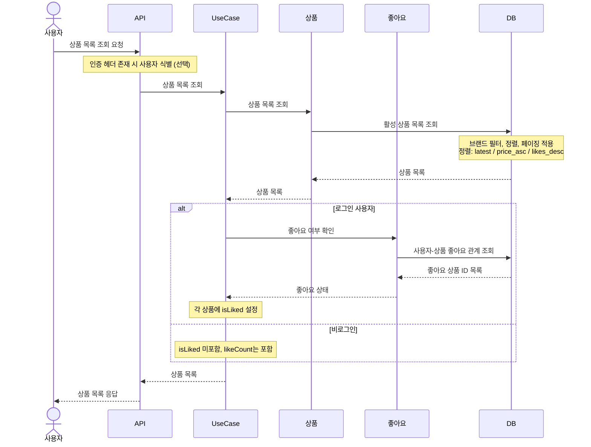
```mermaid
sequenceDiagram
    actor 사용자
    participant API
    participant UseCase
    participant 상품
    participant 좋아요
    participant DB

    사용자->>API: 상품 목록 조회 요청
    Note over API: 인증 헤더 존재 시 사용자 식별 (선택)

    API->>UseCase: 상품 목록 조회
    UseCase->>상품: 상품 목록 조회
    상품->>DB: 활성 상품 목록 조회
    Note over DB: 브랜드 필터, 정렬, 페이징 적용<br/>정렬: latest / price_asc / likes_desc
    DB-->>상품: 상품 목록
    상품-->>UseCase: 상품 목록

    alt 로그인 사용자
        UseCase->>좋아요: 좋아요 여부 확인
        좋아요->>DB: 사용자-상품 좋아요 관계 조회
        DB-->>좋아요: 좋아요 상품 ID 목록
        좋아요-->>UseCase: 좋아요 상태
        Note over UseCase: 각 상품에 isLiked 설정
    else 비로그인
        Note over UseCase: isLiked 미포함, likeCount는 포함
    end

    UseCase-->>API: 상품 목록
    API-->>사용자: 상품 목록 응답
```

**핵심 포인트**:
- likeCount는 상품 컬럼(비정규화)이므로 별도 쿼리 없이 항상 포함
- isLiked는 로그인 사용자에게만 제공 — UseCase가 상품+좋아요 두 도메인을 조율하는 이유

---

### 상품 상세 조회

**목적**: 상품+브랜드+좋아요 3개 도메인 조합 흐름과, 로그인 여부에 따른 선택적 좋아요 조회를 확인한다.

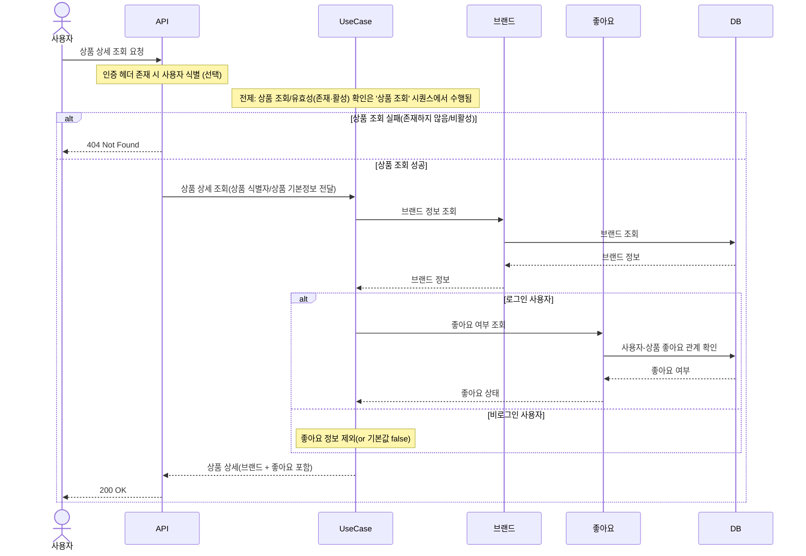
```mermaid
sequenceDiagram
    actor 사용자
    participant API
    participant UseCase
    participant 브랜드
    participant 좋아요
    participant DB

    사용자->>API: 상품 상세 조회 요청
    Note over API: 인증 헤더 존재 시 사용자 식별 (선택)
    Note over UseCase: 전제: 상품 조회/유효성(존재·활성) 확인은 '상품 조회' 시퀀스에서 수행됨

    alt 상품 조회 실패(존재하지 않음/비활성)
        API-->>사용자: 404 Not Found
    else 상품 조회 성공
        API->>UseCase: 상품 상세 조회(상품 식별자/상품 기본정보 전달)

        UseCase->>브랜드: 브랜드 정보 조회
        브랜드->>DB: 브랜드 조회
        DB-->>브랜드: 브랜드 정보
        브랜드-->>UseCase: 브랜드 정보

        alt 로그인 사용자
            UseCase->>좋아요: 좋아요 여부 조회
            좋아요->>DB: 사용자-상품 좋아요 관계 확인
            DB-->>좋아요: 좋아요 여부
            좋아요-->>UseCase: 좋아요 상태
        else 비로그인 사용자
            Note over UseCase: 좋아요 정보 제외(or 기본값 false)
        end

        UseCase-->>API: 상품 상세(브랜드 + 좋아요 포함)
        API-->>사용자: 200 OK
    end
```

**핵심 포인트**:
- UseCase가 3개 서비스를 조율 — 브랜드 조회는 항상, 좋아요 확인은 로그인 시에만
- 상품이 없으면 브랜드·좋아요 조회 자체를 하지 않음 (불필요한 호출 방지)

---

### 좋아요 등록

**목적**: 멱등성 보장과, 좋아요 도메인이 상품 도메인의 like_count를 직접 갱신하는 cross-domain 의존 흐름을 확인한다.

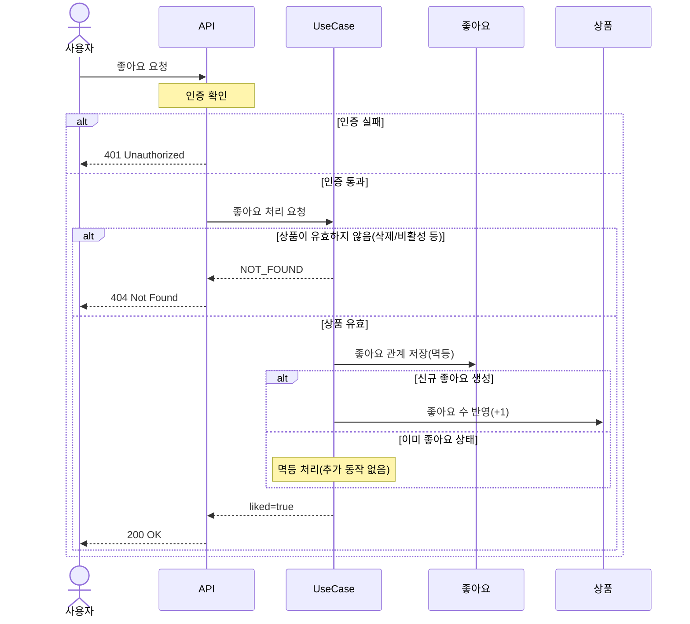
```mermaid
sequenceDiagram
    actor 사용자
    participant API
    participant UseCase
    participant 좋아요
    participant 상품

    사용자->>API: 좋아요 요청
    Note over API: 인증 확인

    alt 인증 실패
        API-->>사용자: 401 Unauthorized
    else 인증 통과
        API->>UseCase: 좋아요 처리 요청

        alt 상품이 유효하지 않음(삭제/비활성 등)
            UseCase-->>API: NOT_FOUND
            API-->>사용자: 404 Not Found
        else 상품 유효
            UseCase->>좋아요: 좋아요 관계 저장(멱등)

            alt 신규 좋아요 생성
                UseCase->>상품: 좋아요 수 반영(+1)
            else 이미 좋아요 상태
                Note over UseCase: 멱등 처리(추가 동작 없음)
            end

            UseCase-->>API: liked=true
            API-->>사용자: 200 OK
        end
    end
```

**핵심 포인트**:
- 이미 좋아요 상태면 추가 동작 없음 (멱등)
- 좋아요 도메인이 상품 도메인의 like_count를 직접 갱신 — cross-domain 의존이 존재하는 지점

---

### 좋아요 취소

**목적**: 등록의 역연산으로서 대칭적 흐름 확인과, 상품 존재 확인이 등록과 동일하게 적용되는지 확인한다.

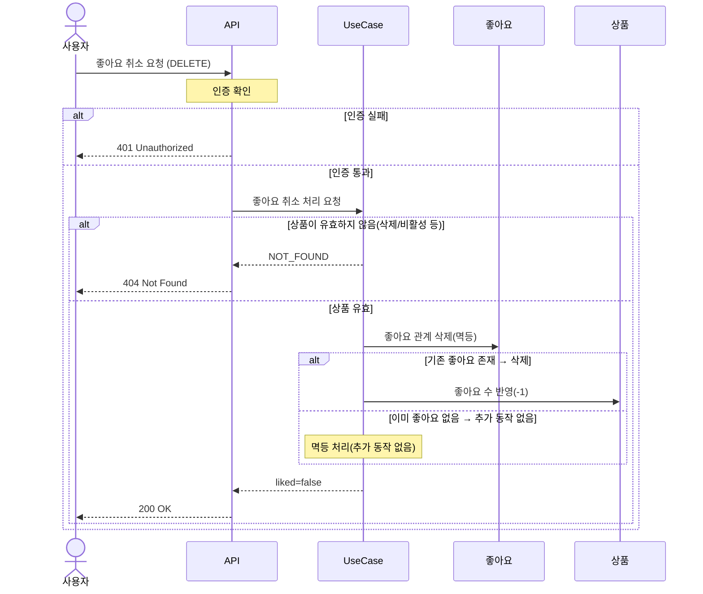
```mermaid
sequenceDiagram
    actor 사용자
    participant API
    participant UseCase
    participant 좋아요
    participant 상품

    사용자->>API: 좋아요 취소 요청 (DELETE)
    Note over API: 인증 확인

    alt 인증 실패
        API-->>사용자: 401 Unauthorized
    else 인증 통과
        API->>UseCase: 좋아요 취소 처리 요청

        alt 상품이 유효하지 않음(삭제/비활성 등)
            UseCase-->>API: NOT_FOUND
            API-->>사용자: 404 Not Found
        else 상품 유효
            UseCase->>좋아요: 좋아요 관계 삭제(멱등)

            alt 기존 좋아요 존재 → 삭제
                UseCase->>상품: 좋아요 수 반영(-1)
            else 이미 좋아요 없음 → 추가 동작 없음
                Note over UseCase: 멱등 처리(추가 동작 없음)
            end

            UseCase-->>API: liked=false
            API-->>사용자: 200 OK
        end
    end
```

**핵심 포인트**:
- 등록과 대칭적 구조 — 상품 존재 확인 → 좋아요 상태 확인 → 취소/멱등
- 삭제된 상품이면 404 반환 (좋아요 관계는 DB에 남아 있지만 취소 불가)

---

### 내가 좋아요한 상품 목록 조회

**목적**: 타인 조회 차단과, 삭제된 상품을 목록에서 제외하는 필터링 정책을 확인한다.

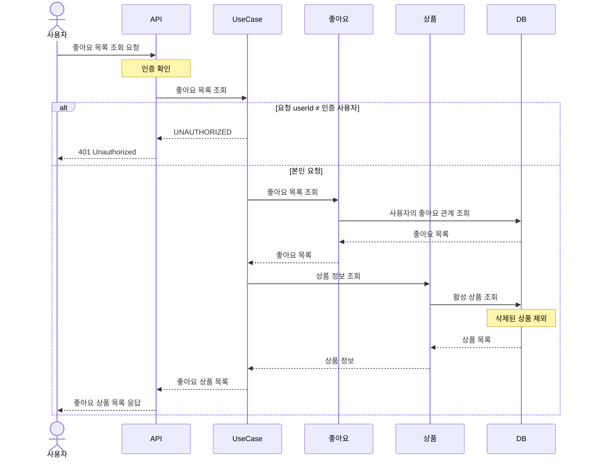
```mermaid
sequenceDiagram
    actor 사용자
    participant API
    participant UseCase
    participant 좋아요
    participant 상품
    participant DB

    사용자->>API: 좋아요 목록 조회 요청
    Note over API: 인증 확인

    API->>UseCase: 좋아요 목록 조회

    alt 요청 userId ≠ 인증 사용자
        UseCase-->>API: UNAUTHORIZED
        API-->>사용자: 401 Unauthorized
    else 본인 요청
        UseCase->>좋아요: 좋아요 목록 조회
        좋아요->>DB: 사용자의 좋아요 관계 조회
        DB-->>좋아요: 좋아요 목록
        좋아요-->>UseCase: 좋아요 목록

        UseCase->>상품: 상품 정보 조회
        상품->>DB: 활성 상품 조회
        Note over DB: 삭제된 상품 제외
        DB-->>상품: 상품 목록
        상품-->>UseCase: 상품 정보

        UseCase-->>API: 좋아요 상품 목록
        API-->>사용자: 좋아요 상품 목록 응답
    end
```

**핵심 포인트**:
- 본인만 조회 가능 (타인 userId 요청 시 401)
- 삭제된 상품은 목록에서 제외 — 좋아요 관계는 DB에 남아 있지만 노출하지 않음

---

### 장바구니 담기

**목적**: 동일 상품 중복 담기 시 수량 누적 정책과, UseCase의 상품 확인 + 장바구니 추가 조율 흐름을 확인한다.

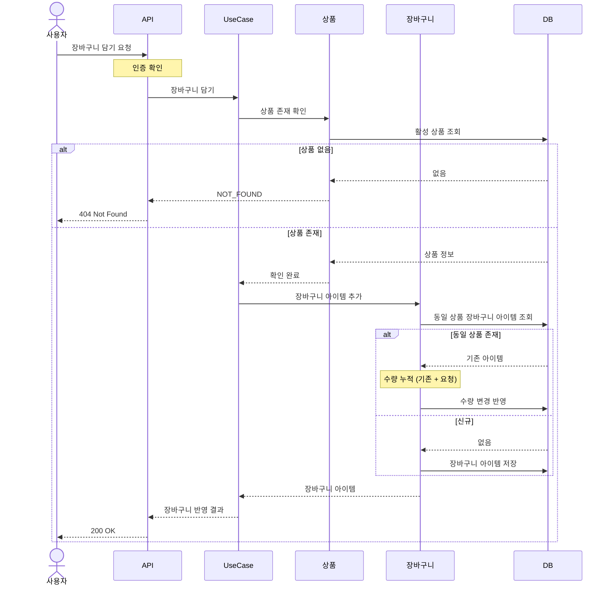
```mermaid
sequenceDiagram
    actor 사용자
    participant API
    participant UseCase
    participant 상품
    participant 장바구니
    participant DB

    사용자->>API: 장바구니 담기 요청
    Note over API: 인증 확인

    API->>UseCase: 장바구니 담기
    UseCase->>상품: 상품 존재 확인
    상품->>DB: 활성 상품 조회

    alt 상품 없음
        DB-->>상품: 없음
        상품-->>API: NOT_FOUND
        API-->>사용자: 404 Not Found
    else 상품 존재
        DB-->>상품: 상품 정보
        상품-->>UseCase: 확인 완료

        UseCase->>장바구니: 장바구니 아이템 추가
        장바구니->>DB: 동일 상품 장바구니 아이템 조회

        alt 동일 상품 존재
            DB-->>장바구니: 기존 아이템
            Note over 장바구니: 수량 누적 (기존 + 요청)
            장바구니->>DB: 수량 변경 반영
        else 신규
            DB-->>장바구니: 없음
            장바구니->>DB: 장바구니 아이템 저장
        end

        장바구니-->>UseCase: 장바구니 아이템
        UseCase-->>API: 장바구니 반영 결과
        API-->>사용자: 200 OK
    end
```

**핵심 포인트**:
- 동일 상품이 이미 있으면 수량 합산 (기존 수량 + 요청 수량)
- 상품 존재 확인은 UseCase가 별도 서비스(상품)를 호출 — 장바구니 도메인은 상품에 의존하지 않음

---

### 장바구니 조회

**목적**: 삭제된 상품을 포함한 조회와 판매 종료 표시 처리, 3개 도메인(장바구니+상품+브랜드) 조합 흐름을 확인한다.

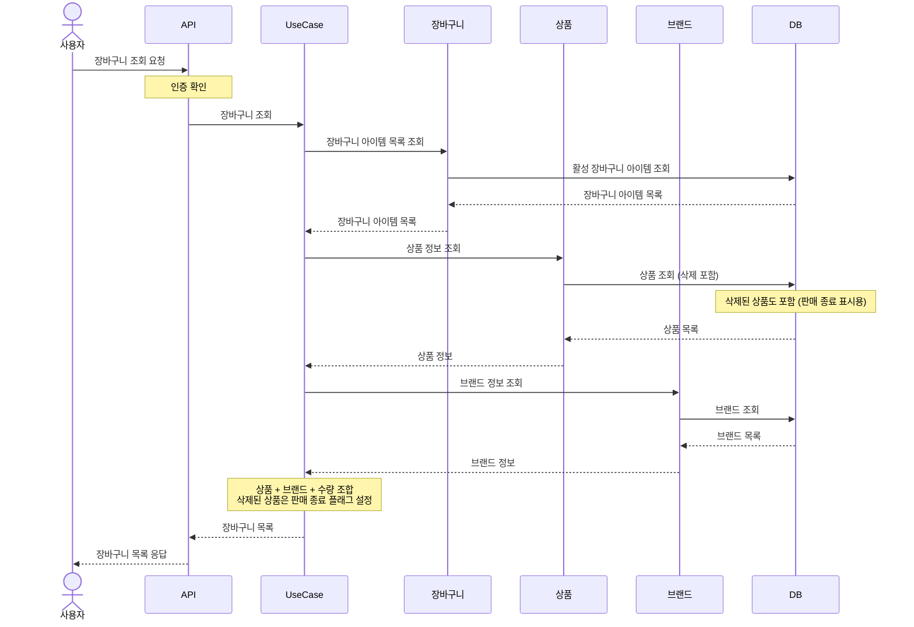
```mermaid
sequenceDiagram
    actor 사용자
    participant API
    participant UseCase
    participant 장바구니
    participant 상품
    participant 브랜드
    participant DB

    사용자->>API: 장바구니 조회 요청
    Note over API: 인증 확인

    API->>UseCase: 장바구니 조회

    UseCase->>장바구니: 장바구니 아이템 목록 조회
    장바구니->>DB: 활성 장바구니 아이템 조회
    DB-->>장바구니: 장바구니 아이템 목록
    장바구니-->>UseCase: 장바구니 아이템 목록

    UseCase->>상품: 상품 정보 조회
    상품->>DB: 상품 조회 (삭제 포함)
    Note over DB: 삭제된 상품도 포함 (판매 종료 표시용)
    DB-->>상품: 상품 목록
    상품-->>UseCase: 상품 정보

    UseCase->>브랜드: 브랜드 정보 조회
    브랜드->>DB: 브랜드 조회
    DB-->>브랜드: 브랜드 목록
    브랜드-->>UseCase: 브랜드 정보

    Note over UseCase: 상품 + 브랜드 + 수량 조합<br/>삭제된 상품은 판매 종료 플래그 설정

    UseCase-->>API: 장바구니 목록
    API-->>사용자: 장바구니 목록 응답
```

**핵심 포인트**:
- 좋아요 목록과 달리, 삭제된 상품도 포함하여 "판매 종료" 플래그로 표시
- UseCase가 장바구니+상품+브랜드 3개 도메인을 조합

---

### 장바구니 수량 변경

**목적**: 단일 도메인 흐름과 수량 검증(1 이상)을 확인한다.

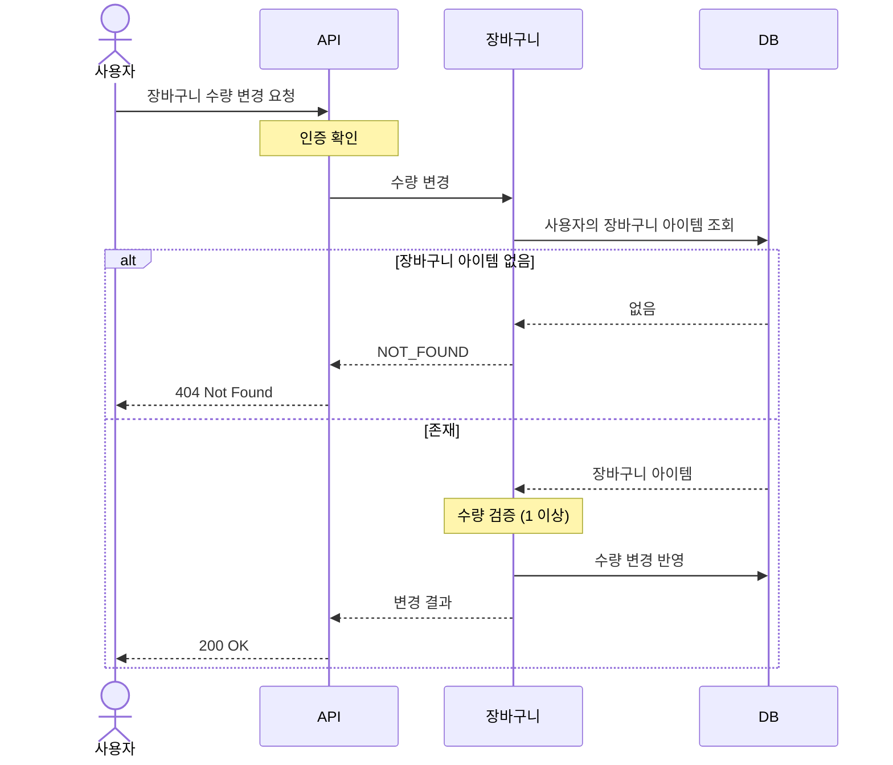
```mermaid
sequenceDiagram
    actor 사용자
    participant API
    participant 장바구니
    participant DB

    사용자->>API: 장바구니 수량 변경 요청
    Note over API: 인증 확인

    API->>장바구니: 수량 변경
    장바구니->>DB: 사용자의 장바구니 아이템 조회

    alt 장바구니 아이템 없음
        DB-->>장바구니: 없음
        장바구니-->>API: NOT_FOUND
        API-->>사용자: 404 Not Found
    else 존재
        DB-->>장바구니: 장바구니 아이템
        Note over 장바구니: 수량 검증 (1 이상)
        장바구니->>DB: 수량 변경 반영
        장바구니-->>API: 변경 결과
        API-->>사용자: 200 OK
    end
```

**핵심 포인트**:
- 단일 서비스 호출이므로 UseCase 불필요
- 수량 1 미만 요청은 도메인에서 검증 후 거부

---

### 장바구니 삭제

**목적**: soft delete 처리 방식을 확인한다.

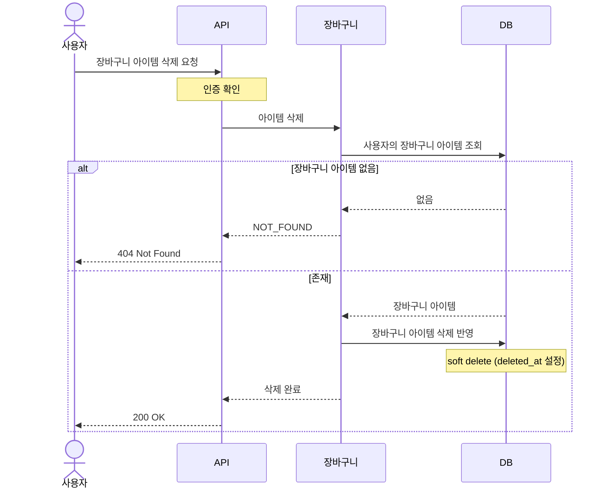
```mermaid
sequenceDiagram
    actor 사용자
    participant API
    participant 장바구니
    participant DB

    사용자->>API: 장바구니 아이템 삭제 요청
    Note over API: 인증 확인

    API->>장바구니: 아이템 삭제
    장바구니->>DB: 사용자의 장바구니 아이템 조회

    alt 장바구니 아이템 없음
        DB-->>장바구니: 없음
        장바구니-->>API: NOT_FOUND
        API-->>사용자: 404 Not Found
    else 존재
        DB-->>장바구니: 장바구니 아이템
        장바구니->>DB: 장바구니 아이템 삭제 반영
        Note over DB: soft delete (deleted_at 설정)
        장바구니-->>API: 삭제 완료
        API-->>사용자: 200 OK
    end
```

**핵심 포인트**:
- 물리 삭제가 아닌 soft delete (deleted_at 설정)
- 단일 서비스이므로 UseCase 불필요

---

### 주문 생성

**목적**: 재고 차감+주문 생성의 트랜잭션 경계, 비관적 락을 통한 동시성 제어, 스냅샷 저장, 그리고 장바구니 정리의 별도 트랜잭션 분리를 검증한다.

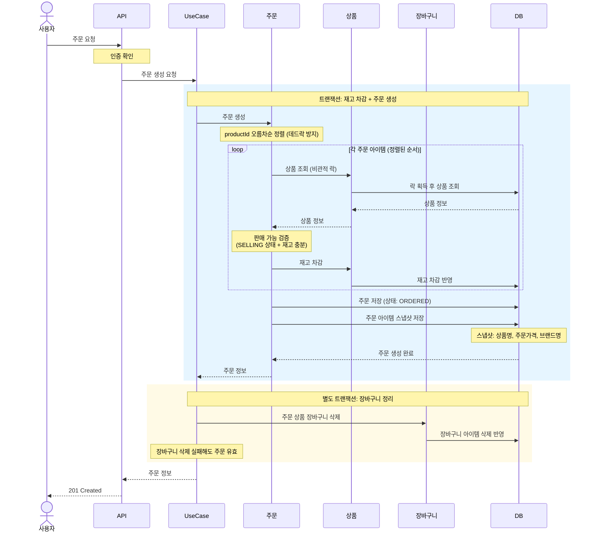
```mermaid
sequenceDiagram
    actor 사용자
    participant API
    participant UseCase
    participant 주문
    participant 상품
    participant 장바구니
    participant DB

    사용자->>API: 주문 요청
    Note over API: 인증 확인

    API->>UseCase: 주문 생성 요청

    rect rgb(230, 245, 255)
        Note over UseCase,DB: 트랜잭션: 재고 차감 + 주문 생성

        UseCase->>주문: 주문 생성
        Note over 주문: productId 오름차순 정렬 (데드락 방지)

        loop 각 주문 아이템 (정렬된 순서)
            주문->>상품: 상품 조회 (비관적 락)
            상품->>DB: 락 획득 후 상품 조회
            DB-->>상품: 상품 정보
            상품-->>주문: 상품 정보

            Note over 주문: 판매 가능 검증<br/>(SELLING 상태 + 재고 충분)

            주문->>상품: 재고 차감
            상품->>DB: 재고 차감 반영
        end

        주문->>DB: 주문 저장 (상태: ORDERED)
        주문->>DB: 주문 아이템 스냅샷 저장
        Note over DB: 스냅샷: 상품명, 주문가격, 브랜드명
        DB-->>주문: 주문 생성 완료
        주문-->>UseCase: 주문 정보
    end

    rect rgb(255, 250, 230)
        Note over UseCase,DB: 별도 트랜잭션: 장바구니 정리

        UseCase->>장바구니: 주문 상품 장바구니 삭제
        장바구니->>DB: 장바구니 아이템 삭제 반영
        Note over UseCase: 장바구니 삭제 실패해도 주문 유효
    end

    UseCase-->>API: 주문 정보
    API-->>사용자: 201 Created
```

**핵심 포인트**:
- 재고 차감 + 주문 생성은 하나의 트랜잭션. productId 오름차순 비관적 락으로 데드락 방지
- 장바구니 삭제는 별도 트랜잭션 — 실패해도 주문은 유효 (최종 일관성)
- 주문 도메인이 상품 도메인을 직접 호출하여 재고 차감 (cross-domain 의존)

---

### 주문 목록 조회

**목적**: 기간 조건 기반 조회와 본인 주문만 조회되는 흐름을 확인한다.

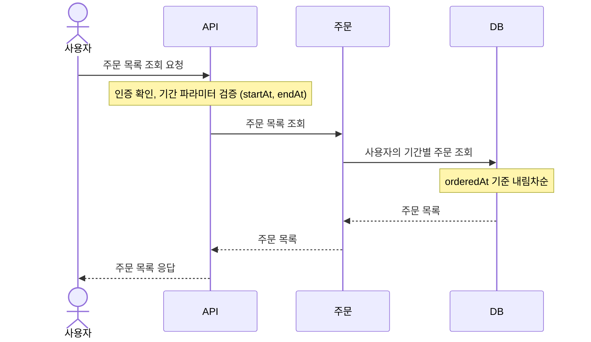
```mermaid
sequenceDiagram
    actor 사용자
    participant API
    participant 주문
    participant DB

    사용자->>API: 주문 목록 조회 요청
    Note over API: 인증 확인, 기간 파라미터 검증 (startAt, endAt)

    API->>주문: 주문 목록 조회
    주문->>DB: 사용자의 기간별 주문 조회
    Note over DB: orderedAt 기준 내림차순
    DB-->>주문: 주문 목록
    주문-->>API: 주문 목록
    API-->>사용자: 주문 목록 응답
```

**핵심 포인트**:
- 단일 서비스이므로 UseCase 불필요
- 본인 주문만 조회 (userId 필터)

---

### 주문 상세 조회

**목적**: 본인 주문 권한 검증 흐름과 스냅샷 포함 응답을 확인한다.

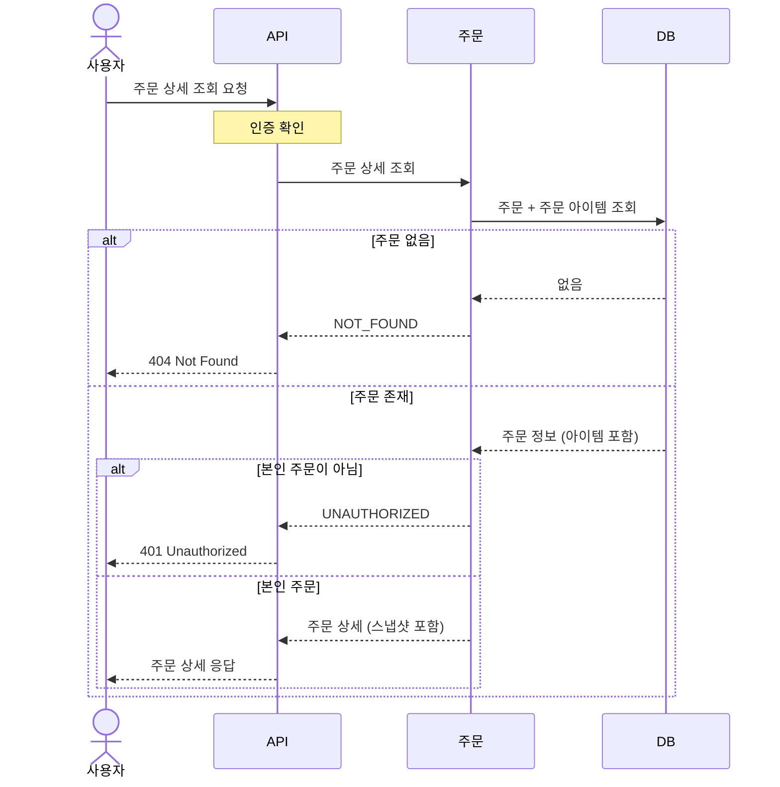
```mermaid
sequenceDiagram
    actor 사용자
    participant API
    participant 주문
    participant DB

    사용자->>API: 주문 상세 조회 요청
    Note over API: 인증 확인

    API->>주문: 주문 상세 조회
    주문->>DB: 주문 + 주문 아이템 조회

    alt 주문 없음
        DB-->>주문: 없음
        주문-->>API: NOT_FOUND
        API-->>사용자: 404 Not Found
    else 주문 존재
        DB-->>주문: 주문 정보 (아이템 포함)

        alt 본인 주문이 아님
            주문-->>API: UNAUTHORIZED
            API-->>사용자: 401 Unauthorized
        else 본인 주문
            주문-->>API: 주문 상세 (스냅샷 포함)
            API-->>사용자: 주문 상세 응답
        end
    end
```

**핵심 포인트**:
- 주문 존재 확인 → 본인 확인 순서로 검증
- 주문 아이템의 스냅샷(상품명, 가격, 브랜드명)이 응답에 포함

---

### 주문 취소

**목적**: 상태 검증(ORDERED만 취소 가능), 권한 검증, 재고 복원의 전체 흐름을 확인한다.

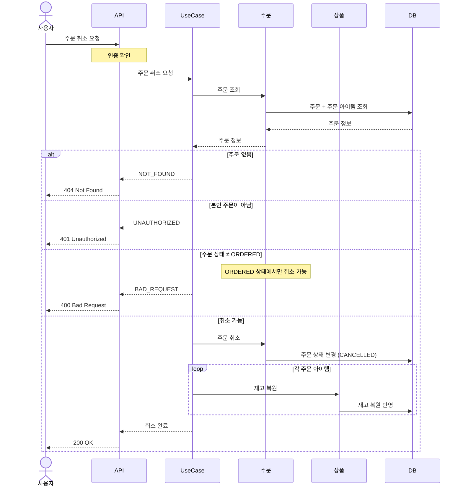
```mermaid
sequenceDiagram
    actor 사용자
    participant API
    participant UseCase
    participant 주문
    participant 상품
    participant DB

    사용자->>API: 주문 취소 요청
    Note over API: 인증 확인

    API->>UseCase: 주문 취소 요청

    UseCase->>주문: 주문 조회
    주문->>DB: 주문 + 주문 아이템 조회
    DB-->>주문: 주문 정보
    주문-->>UseCase: 주문 정보

    alt 주문 없음
        UseCase-->>API: NOT_FOUND
        API-->>사용자: 404 Not Found
    else 본인 주문이 아님
        UseCase-->>API: UNAUTHORIZED
        API-->>사용자: 401 Unauthorized
    else 주문 상태 ≠ ORDERED
        Note over 주문: ORDERED 상태에서만 취소 가능
        UseCase-->>API: BAD_REQUEST
        API-->>사용자: 400 Bad Request
    else 취소 가능
        UseCase->>주문: 주문 취소
        주문->>DB: 주문 상태 변경 (CANCELLED)

        loop 각 주문 아이템
            UseCase->>상품: 재고 복원
            상품->>DB: 재고 복원 반영
        end

        UseCase-->>API: 취소 완료
        API-->>사용자: 200 OK
    end
```

**핵심 포인트**:
- ORDERED 상태에서만 취소 가능 — SHIPPING 이후는 취소 불가
- 주문(상태 변경) + 상품(재고 복원) cross-domain 호출이므로 UseCase가 조율
- 주문 생성의 역연산 구조 — 생성과 동일하게 UseCase를 통해 처리

---

## 어드민 API

---

### 어드민 브랜드 관리

**목적**: 브랜드 CRUD 중 삭제 시 연관 상품의 연쇄 soft delete 흐름과, 삭제에서만 UseCase가 필요한 구조를 확인한다.

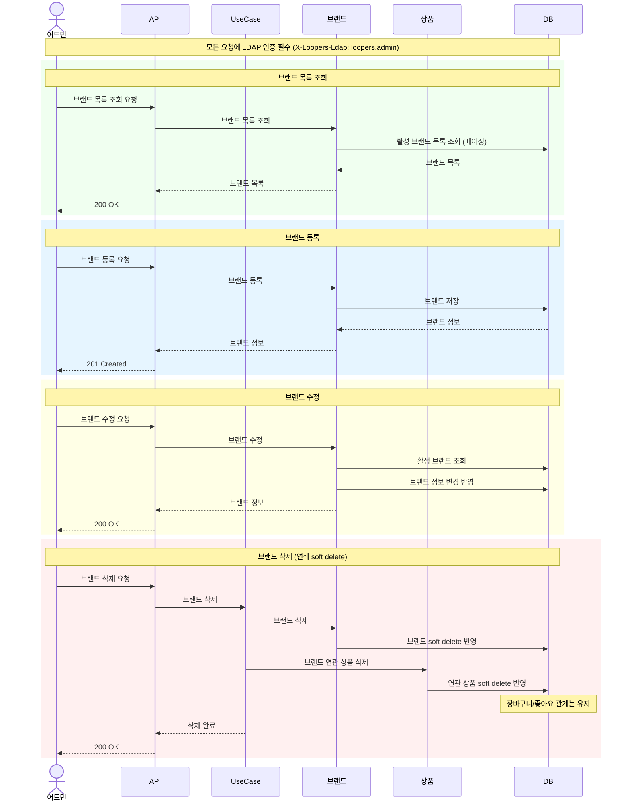
```mermaid
sequenceDiagram
    actor 어드민
    participant API
    participant UseCase
    participant 브랜드
    participant 상품
    participant DB

    Note over 어드민,DB: 모든 요청에 LDAP 인증 필수 (X-Loopers-Ldap: loopers.admin)

    rect rgb(240, 255, 240)
        Note over 어드민,DB: 브랜드 목록 조회
        어드민->>API: 브랜드 목록 조회 요청
        API->>브랜드: 브랜드 목록 조회
        브랜드->>DB: 활성 브랜드 목록 조회 (페이징)
        DB-->>브랜드: 브랜드 목록
        브랜드-->>API: 브랜드 목록
        API-->>어드민: 200 OK
    end

    rect rgb(230, 245, 255)
        Note over 어드민,DB: 브랜드 등록
        어드민->>API: 브랜드 등록 요청
        API->>브랜드: 브랜드 등록
        브랜드->>DB: 브랜드 저장
        DB-->>브랜드: 브랜드 정보
        브랜드-->>API: 브랜드 정보
        API-->>어드민: 201 Created
    end

    rect rgb(255, 255, 230)
        Note over 어드민,DB: 브랜드 수정
        어드민->>API: 브랜드 수정 요청
        API->>브랜드: 브랜드 수정
        브랜드->>DB: 활성 브랜드 조회
        브랜드->>DB: 브랜드 정보 변경 반영
        브랜드-->>API: 브랜드 정보
        API-->>어드민: 200 OK
    end

    rect rgb(255, 240, 240)
        Note over 어드민,DB: 브랜드 삭제 (연쇄 soft delete)
        어드민->>API: 브랜드 삭제 요청
        API->>UseCase: 브랜드 삭제

        UseCase->>브랜드: 브랜드 삭제
        브랜드->>DB: 브랜드 soft delete 반영

        UseCase->>상품: 브랜드 연관 상품 삭제
        상품->>DB: 연관 상품 soft delete 반영
        Note over DB: 장바구니/좋아요 관계는 유지

        UseCase-->>API: 삭제 완료
        API-->>어드민: 200 OK
    end
```

**핵심 포인트**:
- 목록/등록/수정은 단일 서비스로 UseCase 불필요. 삭제만 UseCase가 브랜드+상품을 조율
- 브랜드 삭제 시 연관 상품도 soft delete — 장바구니/좋아요 관계는 유지

---

### 어드민 상품 관리

**목적**: 상품 등록 시 브랜드 검증, 수정 시 브랜드 변경 불가 제약, 삭제 후 장바구니/좋아요 유지를 확인한다.

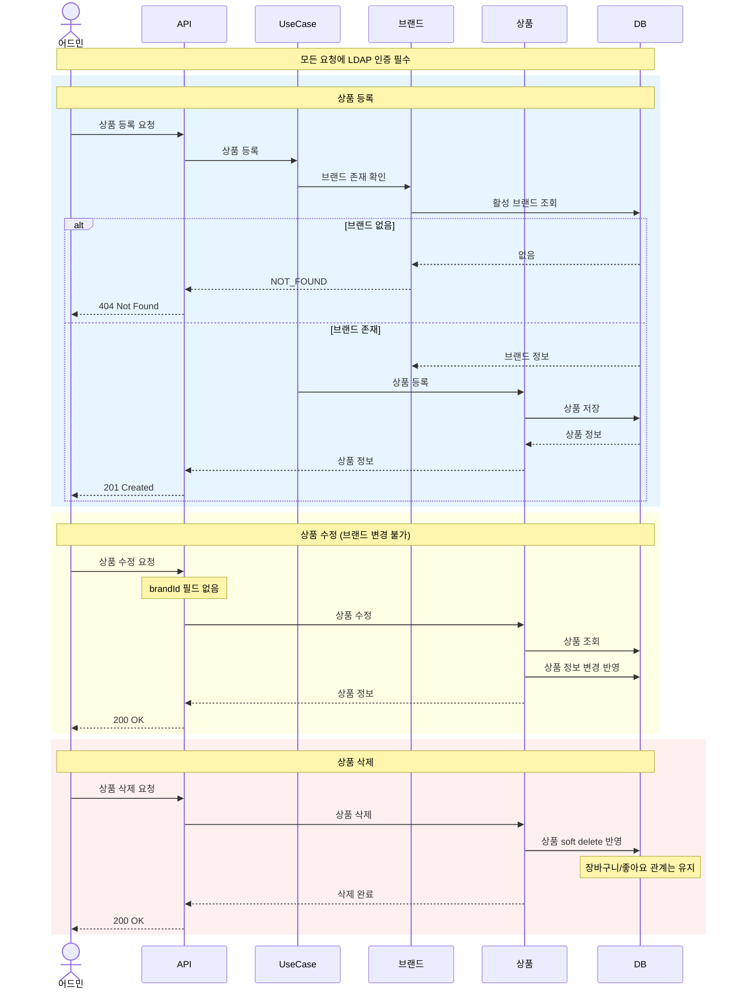
```mermaid
sequenceDiagram
    actor 어드민
    participant API
    participant UseCase
    participant 브랜드
    participant 상품
    participant DB

    Note over 어드민,DB: 모든 요청에 LDAP 인증 필수

    rect rgb(230, 245, 255)
        Note over 어드민,DB: 상품 등록
        어드민->>API: 상품 등록 요청
        API->>UseCase: 상품 등록

        UseCase->>브랜드: 브랜드 존재 확인
        브랜드->>DB: 활성 브랜드 조회

        alt 브랜드 없음
            DB-->>브랜드: 없음
            브랜드-->>API: NOT_FOUND
            API-->>어드민: 404 Not Found
        else 브랜드 존재
            DB-->>브랜드: 브랜드 정보
            UseCase->>상품: 상품 등록
            상품->>DB: 상품 저장
            DB-->>상품: 상품 정보
            상품-->>API: 상품 정보
            API-->>어드민: 201 Created
        end
    end

    rect rgb(255, 255, 230)
        Note over 어드민,DB: 상품 수정 (브랜드 변경 불가)
        어드민->>API: 상품 수정 요청
        Note over API: brandId 필드 없음
        API->>상품: 상품 수정
        상품->>DB: 상품 조회
        상품->>DB: 상품 정보 변경 반영
        상품-->>API: 상품 정보
        API-->>어드민: 200 OK
    end

    rect rgb(255, 240, 240)
        Note over 어드민,DB: 상품 삭제
        어드민->>API: 상품 삭제 요청
        API->>상품: 상품 삭제
        상품->>DB: 상품 soft delete 반영
        Note over DB: 장바구니/좋아요 관계는 유지
        상품-->>API: 삭제 완료
        API-->>어드민: 200 OK
    end
```

**핵심 포인트**:
- 등록 시에만 UseCase 필요 (브랜드 존재 확인). 수정/삭제는 단일 서비스
- 수정 시 brandId 필드 자체가 없어 브랜드 변경 불가를 구조적으로 강제

---

### 어드민 주문 관리

**목적**: 어드민 주문 조회(본인 검증 없음)와 상태 전이 규칙(SHIPPING→CANCELLED 제거됨)을 확인한다.

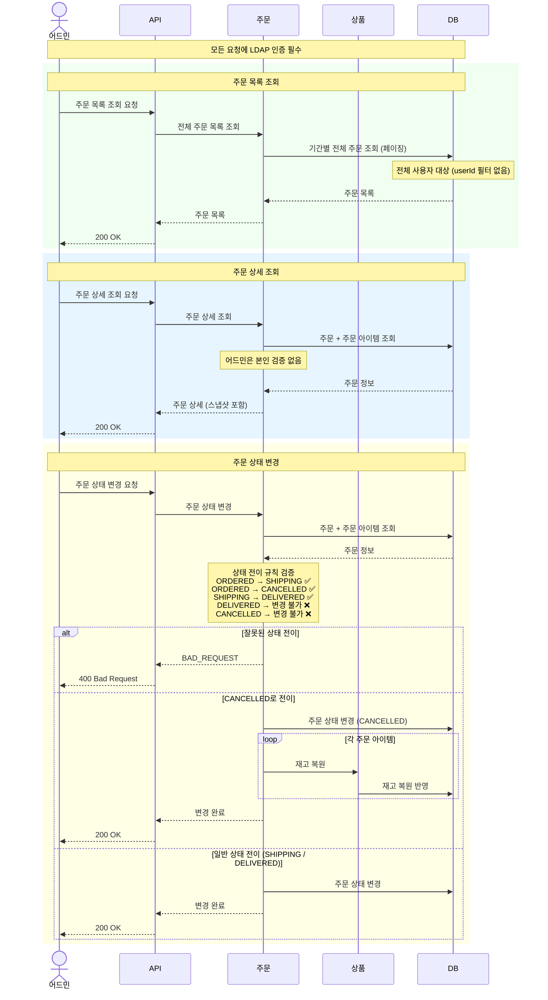
```mermaid
sequenceDiagram
    actor 어드민
    participant API
    participant 주문
    participant 상품
    participant DB

    Note over 어드민,DB: 모든 요청에 LDAP 인증 필수

    rect rgb(240, 255, 240)
        Note over 어드민,DB: 주문 목록 조회
        어드민->>API: 주문 목록 조회 요청
        API->>주문: 전체 주문 목록 조회
        주문->>DB: 기간별 전체 주문 조회 (페이징)
        Note over DB: 전체 사용자 대상 (userId 필터 없음)
        DB-->>주문: 주문 목록
        주문-->>API: 주문 목록
        API-->>어드민: 200 OK
    end

    rect rgb(230, 245, 255)
        Note over 어드민,DB: 주문 상세 조회
        어드민->>API: 주문 상세 조회 요청
        API->>주문: 주문 상세 조회
        주문->>DB: 주문 + 주문 아이템 조회
        Note over 주문: 어드민은 본인 검증 없음
        DB-->>주문: 주문 정보
        주문-->>API: 주문 상세 (스냅샷 포함)
        API-->>어드민: 200 OK
    end

    rect rgb(255, 255, 230)
        Note over 어드민,DB: 주문 상태 변경
        어드민->>API: 주문 상태 변경 요청
        API->>주문: 주문 상태 변경
        주문->>DB: 주문 + 주문 아이템 조회
        DB-->>주문: 주문 정보

        Note over 주문: 상태 전이 규칙 검증<br/>ORDERED → SHIPPING ✅<br/>ORDERED → CANCELLED ✅<br/>SHIPPING → DELIVERED ✅<br/>DELIVERED → 변경 불가 ❌<br/>CANCELLED → 변경 불가 ❌

        alt 잘못된 상태 전이
            주문-->>API: BAD_REQUEST
            API-->>어드민: 400 Bad Request
        else CANCELLED로 전이
            주문->>DB: 주문 상태 변경 (CANCELLED)

            loop 각 주문 아이템
                주문->>상품: 재고 복원
                상품->>DB: 재고 복원 반영
            end

            주문-->>API: 변경 완료
            API-->>어드민: 200 OK
        else 일반 상태 전이 (SHIPPING / DELIVERED)
            주문->>DB: 주문 상태 변경
            주문-->>API: 변경 완료
            API-->>어드민: 200 OK
        end
    end
```

**핵심 포인트**:
- SHIPPING → CANCELLED 전이 제거됨 — ORDERED에서만 취소 가능
- 어드민은 전체 사용자 주문 조회 가능, 본인 검증 없음
- 주문 조회/상태 변경은 단일 서비스이므로 UseCase 불필요