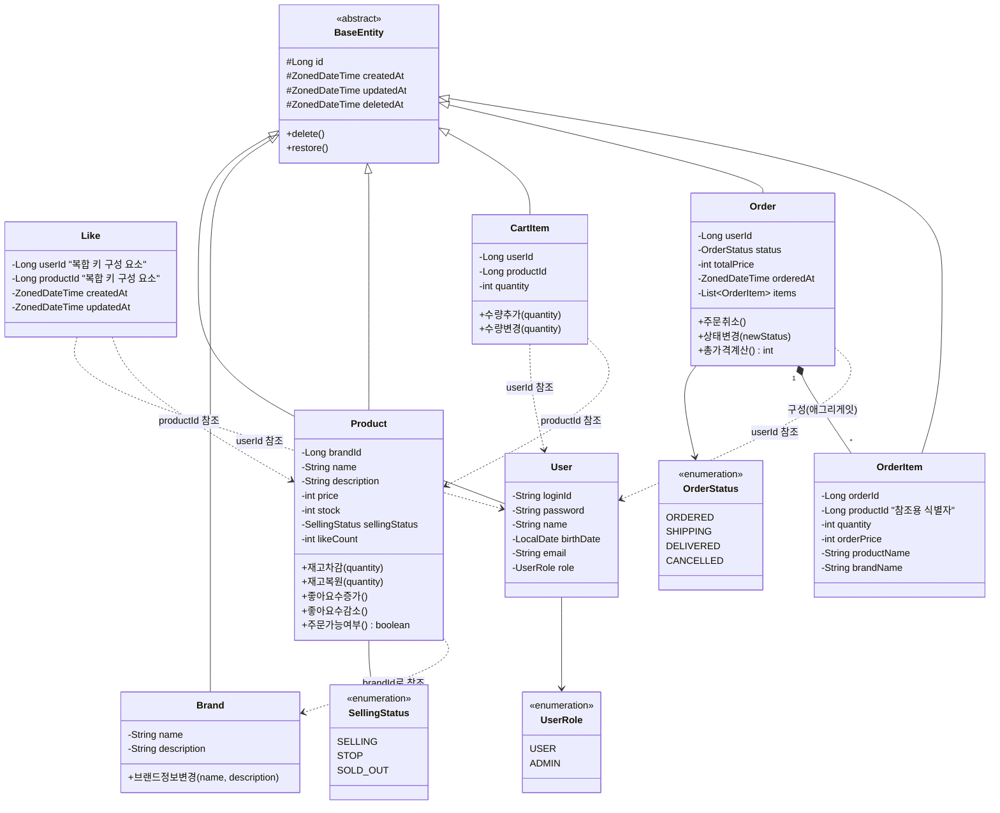

# 도메인 객체 클래스 다이어그램

---

## 설계 포인트

### 1. BaseEntity 상속 구조
- `BaseEntity`가 `id`, `createdAt`, `updatedAt`, `deletedAt`, `delete()`, `restore()`를 제공
- Brand, Product, CartItem, Order, OrderItem, User는 BaseEntity를 상속
- **예외**: `Like`는 복합 키(`userId` + `productId`)를 사용하므로 BaseEntity 상속 불가 → `@IdClass` 또는 `@EmbeddedId` 별도 구현

### 2. OrderStatus 상태 전이 규칙
- `ORDERED → SHIPPING` / `ORDERED → CANCELLED` / `SHIPPING → DELIVERED`만 허용
- `DELIVERED`, `CANCELLED`에서는 변경 불가
- `상태변경(newStatus)` 메서드 내에서 전이 가능 여부 검증

### 3. Product.주문가능여부() 판단 기준
- `sellingStatus == SELLING` **AND** `stock > 0` 복합 조건
- 두 조건 중 하나라도 불충족 시 주문 불가

### 5. Cross-domain 의존성 (UseCase 레벨)
| UseCase | 호출 대상 | 비고 |
|---------|-----------|------|
| 좋아요 등록/취소 | Product.좋아요수증가/감소() | likeCount 비정규화 갱신 |
| 주문 생성 | Product.재고차감() | 비관적 락, productId 오름차순 데드락 방지 |
| 주문 취소 | Product.재고복원() | 주문 생성의 역연산 |
| 브랜드 삭제 | Product.삭제() | 연쇄 soft delete |
| 주문 생성 | CartItem 삭제 | 별도 트랜잭션 (실패해도 주문 유효) |

### 6. Aggregate Boundary
- **Order Aggregate**: Order(Root) + OrderItem → OrderItem은 독립 Repository 없이 Order를 통해서만 접근
- 나머지 엔티티(User, Brand, Product, CartItem, Like)는 각각 독립 Aggregate Root

### 7. Order.totalPrice 계산
- `totalPrice = Σ(OrderItem.quantity × OrderItem.orderPrice)`
- 주문 생성 시 계산하여 저장 (조회 성능 최적화)