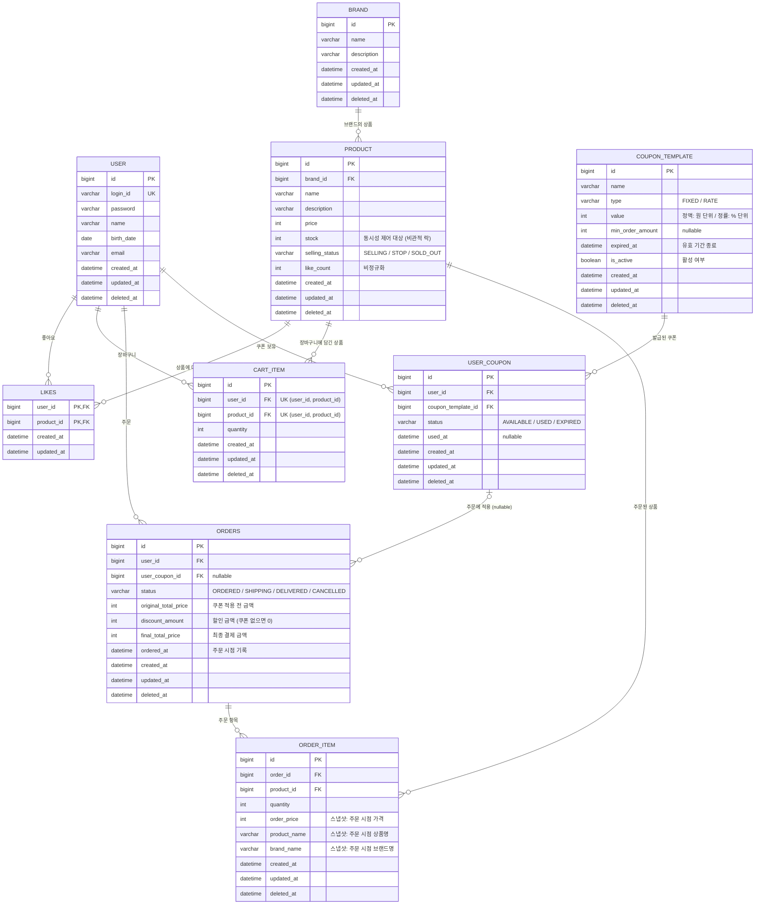

# ERD

---

## 설계 포인트

### 1. Soft Delete 전략
- `deleted_at`이 있는 테이블: USER, BRAND, PRODUCT, CART_ITEM, ORDERS, ORDER_ITEM, COUPON_TEMPLATE, USER_COUPON
- `deleted_at`이 **없는** 테이블: LIKES (물리 삭제 — 좋아요 취소 시 행 자체 삭제)
- 조회 시 `WHERE deleted_at IS NULL` 조건 필수 (사용자 API 기준)
- COUPON_TEMPLATE: soft delete 후 어드민 목록에서 제외, 발급 불가 처리

### 2. 복합 키 vs 대리 키
- **LIKES**: 복합 PK (`user_id` + `product_id`) — 1인 1상품 1좋아요를 DB 레벨에서 보장
- **CART_ITEM**: 대리 키 (`id` PK) + 복합 유니크 (`user_id`, `product_id`) — 수량 변경이 빈번하여 대리 키 사용
- **ORDER_ITEM**: 대리 키 (`id` PK) — 동일 상품을 다른 주문에서 반복 주문 가능

### 3. 비정규화 필드
- `PRODUCT.like_count`: 좋아요 수 캐싱 (COUNT 쿼리 회피, 갱신 시 동시성 고려 필요)
- `ORDER_ITEM.product_name`, `ORDER_ITEM.brand_name`, `ORDER_ITEM.order_price`: 주문 시점 스냅샷 (원본 변경에 영향받지 않음)

### 4. ORDERS 금액 필드 분리
- `total_price` (단일) → `original_total_price` + `discount_amount` + `final_total_price` 3개 필드로 분리
- `discount_amount`는 쿠폰 미적용 시 0, `user_coupon_id`는 nullable
- `final_total_price = original_total_price - discount_amount`

### 5. 인덱스 후보
| 테이블 | 컬럼 | 사유 |
|--------|-------|------|
| PRODUCT | `brand_id` | 브랜드별 상품 필터링 |
| PRODUCT | `selling_status` | 판매 상태별 조회 |
| CART_ITEM | `(user_id, product_id)` | 유니크 제약 + 중복 담기 방지 |
| ORDERS | `(user_id, ordered_at)` | 사용자별 기간 주문 조회 |
| ORDER_ITEM | `order_id` | 주문별 아이템 조회 |
| USER_COUPON | `user_id` | 사용자별 쿠폰 목록 조회 |
| USER_COUPON | `coupon_template_id` | 템플릿별 발급 내역 조회 |

### 6. 동시성 제어 대상
- `PRODUCT.stock`: 주문 시 비관적 락 (`SELECT ... FOR UPDATE`, productId 오름차순)
- `PRODUCT.like_count`: 좋아요 등록/취소 시 갱신 (동시성 제어 방식 결정 필요)